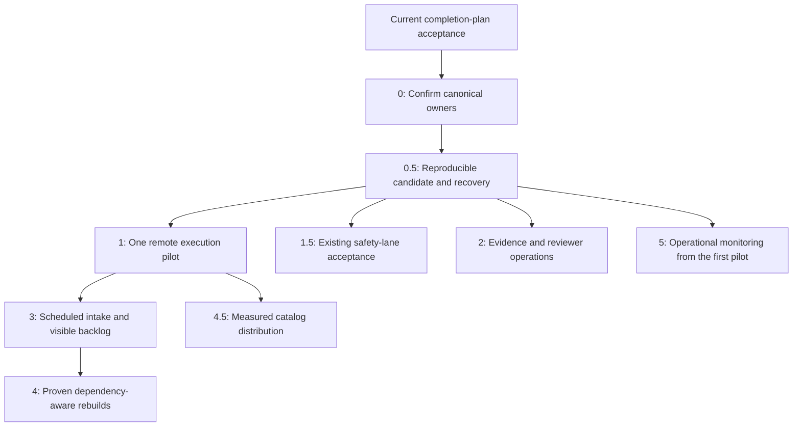
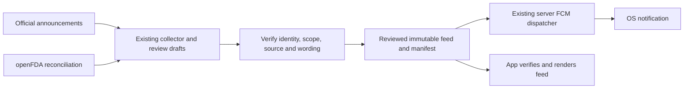

# PharmaGuide — Automation & Collaboration Roadmap v2

Updated October 6, 2026. Audience: Sean and future implementation/review collaborators.

**Goal:** Make the existing PharmaGuide pipeline reproducible, recoverable and progressively automated, while retaining one owner for every clinical and product-quality decision.

**Architecture:** Reuse Clean → Enrich → Score → Export, the existing preparation/freshness checks, versioned artifacts, reviewed clinical data and release chain. Automate preparation and execution around those owners. Flutter and future website/API consumers read canonical exports.

**Technology baseline:** Python 3.13, GitHub Actions, SQLite/Drift, Supabase and the existing FCM HTTP v1 delivery components. Object storage, remote compute, uv and additional agent automation are measured pilots, not mandatory migrations.

This is a direction and sequence, not a fixed six-month promise or authorization to deploy every proposal. Before implementing a phase, bound its batch, confirm its owner, record acceptance criteria and resolve any new policy or public-contract decision with Sean. Use the current execution workflow; delegate only within authorized scope.

## 1. How this roadmap relates to today's work

The [master completion plan](plans/PHARMAGUIDE_MASTER_COMPLETION_PLAN.md) owns current scoring, clinical coverage, app acceptance and release completion. The [existing LEDGER](../scripts/audits/pending_items_20260926/LEDGER.md) remains the execution register. This roadmap describes subsequent automation and links back to that work; it does not add to or recalculate its completion percentage.

Use these states precisely: proposed, implemented, measured, independently reviewed, integrated, release-validated and published. Source code or a scheduled task being present does not establish deployment, successful execution or delivery to a phone.

Current-source inspection established the components below. Run receipts and remaining release blockers belong in the master plan/handoff rather than being copied here as permanent counts or SHAs.

| Area | Existing capability | What still needs automation or acceptance |
|---|---|---|
| DSLD intake | API client; raw payload hashing; shared sync state; new/changed/unchanged classification and form routing | Scheduled complete discovery, resumable processing and visible backlog |
| Pipeline preparation | Aggregate checks, current raw canaries, live verification and input-stability checks | Hosted execution with the same prerequisites and usable failure reports |
| Stage reuse | Code/reference fingerprints and stage manifests | Remote restoration and any narrower reuse must prove equivalent provenance |
| Test CI | Existing sharded whole-fast workflow, declared skip checks and paired app checkout | Corpus/artifact checks need their real inputs; CI currently does not carry the corpus |
| Export/release | Candidate validation, checksums, catalog comparison, release locking, generation/promotion contracts | Exact-candidate approval, publication and post-publication checks stay with the existing release work |
| FDA/safety alerts | Report-only collector, source-review drafts, separately versioned reviewed feed, publisher, app reader and server-side FCM components | Verify deployed configuration, matching, retries and actual device behavior before claiming an operational service |
| Clinical maintenance | Existing evidence registries, topic queues, per-entry verifiers, replay tools and monthly certification renewal | Unified reviewer navigation and coverage reporting over existing records |
| App distribution | Drift/SQLite, embedded manifests, catalog refresh, checksum verification and detail-blob fetch/cache | Measure real size, update cost and offline coverage before changing distribution |

The feedback's historical product/test counts are useful leads, not a new baseline. Reproduce material claims from their source receipts before using them for acceptance. In particular, a weekly evidence scan is not established merely by the feedback mentioning one; inventory the actual scheduler, owner, source coverage and last successful receipt first.

## 2. Owner Check and boundaries

Owner checks below use repository-relative paths. They name existing production seams; implementation must recheck symbols and consumers at its baseline.

| Responsibility | Owner | Evidence checked |
|---|---|---|
| Printed source membership and label provenance | `scripts/enhanced_normalizer.py::EnhancedDSLDNormalizer.normalize_product` | Ownership matrix; normalizer and cleaner consumers |
| Shared ingredient prominence / Evidence subject set | `scripts/scoring_input_contract.py::classify_ingredient_roles` / `get_evidence_subject_rows` | Matrix, glossary and scorer consumers |
| Public product scoring | `scripts/score_supplements_v4.py::score_product_v4` → `scripts/scoring_v4/scored_artifact.py::build_scored_artifact` | Production entry point and export contract |
| Intake fingerprint / delta classification | `scripts/dsld_api_sync.py::canonical_payload_sha256` / `classify_label_change` | `rg` of definitions, state persistence and consumers |
| Preparation / stage freshness | `scripts/preflight.py::run_preparation`; `scripts/pipeline_freshness.py::stage_freshness_issues` | Live preparation wiring, code/reference fingerprint implementation |
| Stage artifact membership | `scripts/stage_manifest.py::select_stage_input_files` | Manifest definitions and downstream stage selection |
| Clinical batch verification | `scripts/data_batch.py`; existing `scripts/api_audit/` verifiers | [Verification runbook](runbooks/verification-gates.md), current registries and claim-check consumers |
| FDA collection and alert drafts | `scripts/api_audit/fda_weekly_sync.py`; `scripts/api_audit/fda_alert_drafts.py` | Report-only wrapper and draft-only semantics |
| Alert meaning, scope and release | `scripts/safety_alerts.py::validate_alert`; `scripts/build_safety_alerts.py`; `scripts/run_safety_alert_publish.sh` | [Alert contract](../scripts/data/safety_alerts/README.md), publisher and paired Flutter reader |
| Core/blob export and candidate validation | `scripts/core_export_model.py`; `scripts/audit_contract_sync.py::BLOB_TOP_LEVEL`; `scripts/release_catalog_artifact.py::validate_release_candidate` | Core schema, declared blob fields and manifest/integrity checks |
| Publication | `scripts/release_full.sh`, invoked through the existing catalog-release procedure | [Release rules](../.claude/rules/release.md), lock/promotion wiring |
| App activation / detail retrieval | Flutter `lib/data/supabase/sync_service.dart`, `detail_blob_service.dart` and existing database readers | Current version, checksum, compatibility and activation checks |

**Will NOT create:** another scorer, normalizer, brand resolver, Evidence subject selector, clinical registry, public score/status vocabulary, app-side product-quality engine, release chain or execution register. A storage layout, scheduler or UI can wrap existing owners without becoming an alternative source of truth.

A proposed new persisted/public field, registry or semantic owner needs Sean's decision before implementation. Use existing manifest keys and source identities first; do not copy a suggested list of build fields into a second schema.

### Canonical rules automation must preserve

- Unknown amount, explicit zero and estimated amount are distinct facts. Presence-triggered rules use their existing declared applicability; a studied trial amount is not automatically a clinical activation threshold.
- Preserve printed identity, source section, canonical identity, preparation, strain, serving basis and lineage. Active/other membership is separate from efficacy ownership; nutrition facts remain available to the nutrition consumer.
- A blend total is not a child ingredient's dose. Evidence applicability concerns the actual intervention, preparation, population and outcome; amount adequacy stays with the existing Dose owner. Specific formula/strain evidence does not transfer to an unspecified blend.
- Preserve six-pillar maxima of 20 / 20 / 20 / 15 / 15 / 10 and the existing public score contract. Quality uses `quality_tier` / `quality_score_status`; safety uses `product_safety_status`. Legacy `verdict` is a compatibility surface, not a new decision engine.
- Clinical determinations can be applicable, inapplicable, combination-only, no-effect or a bounded no-qualifying-evidence finding. Pending review and insufficient identity remain explicit; successful retrieval does not equal clinical approval.
- Banned/recalled products remain discoverable with their reasons. Approved alert retraction does not clear an independently catalog-owned safety block.
- AI can research, extract, explain and propose. Clinical verification, approved policy and canonical production owners determine what is published. A model's confidence cannot create a source-backed determination.

These summarize existing contracts. Resolve a disagreement through the matrix, accepted ADRs and source review; this document cannot silently replace them.

## 3. Execution order

The phase numbers retain continuity with the old roadmap. Basic backups, run health and rollback start early; advanced observability grows with usage. Research/reviewer and safety acceptance can proceed in isolated lanes while a remote compute pilot is prepared. Shared scoring owners and publication remain under one integrator.

Do not displace the active final app/release lane. Complete its bounded acceptance work and read its handoff before scheduling broad jobs. A documentation rewrite does not itself request a corpus run.

## Phase 0 — Confirm the canonical pipeline contract

**Purpose:** Make automation call the same owners that currently produce product results.

**Work:**

1. Reconcile the master plan, current lane handoffs, matrix, glossary and release rules. Identify conflicts as findings; retain valid completed work.
2. Trace representative raw labels through Clean, Enrich, Score, export and Flutter. Include unknown amounts, blends, nutrition zeros, branded identities, alternate servings, probiotics, omega, held identities and blocked products.
3. Map each planned automation to its owner and consumers. Remove proposed duplicate configs, fields and parsers; the existing dataset discovery and intake state are the starting point for scheduling.
4. Inventory actual scheduled jobs, credentials/prerequisites, source coverage and durable receipts. Distinguish local desktop tasks from services that run while the laptop is off.

**Deliverable:** One bounded owner/readiness packet in the existing register, referencing current contracts and identified gaps. It is not a new clinical specification or blanket score recalibration.

**Acceptance:** Every proposed automation has a named owner, input/output contract and policy boundary; current acceptance blockers are assigned. Any owner conflict is resolved or explicitly held before dependent automation proceeds.

## Phase 0.5 — Reproducible release integrity and recovery

**Purpose:** Produce a candidate whose inputs, decisions and consumer artifacts can be inspected and restored.

**Work:**

1. Reuse existing raw canaries, frozen-label replay cases and reviewed clinical fixtures. Map coverage by defect class: blend/member exposure, unknown amounts, presence rules, form/strain mismatch, certification identity, numeric contamination, safety precedence and nutrition fidelity. Add independently reviewed cases for demonstrated gaps; do not invent a parallel 300–500-case registry merely to hit a count.
2. Separate source-backed checks from checks requiring rebuilt artifacts. Follow [AGENTS.md](../AGENTS.md) validation classes: targeted iteration, one finished-batch checkpoint, then final-candidate checks.
3. Once planned output-changing work is integrated, ask the existing freshness owner for the earliest required stage. Changed raw labels require Clean unless reuse is independently proven. Run the necessary corpus pass with publication disabled, then catalog/interaction/app checks and sequential release/full backstop gates.
4. Produce movement reports through the existing comparison owner. Include score/pillar, route, status, safety, blocking reason, newly scored/held and lost-warning changes, plus explained causes and unaffected controls.
5. Freeze the existing candidate manifest and linked receipts: source SHAs, input/reference/config fingerprints, catalog generation, artifact hashes, counts, exclusions/holds, clinical dispositions, expected failures and review. Add missing provenance to the existing contract only after an Owner Check and any required approval.
6. Restore a previous compatible candidate into an isolated environment. Verify its core, blobs, interaction artifact and app manifests belong together. Document credential/config requirements separately from artifact backups.

**Acceptance:** Current provenance and required gates pass; unexplained deltas are zero; release-critical expected failures are closed or explicitly approved as irrelevant to shipped behavior. An exact candidate is reviewable and a compatible rollback is demonstrated. Publication remains Sean's explicit decision.

**Movement policy:** Ordinary explained score/tier changes remain report-only under the accepted development policy. Large deltas prioritize investigation; they do not create automatic per-product approval requirements. Safety weakening and warned-product removal retain the existing reviewed-exception gates. Any new numerical movement budget is a proposal requiring approval, not an implied policy in this roadmap.

## Phase 1 — Immutable artifacts and one remote execution pilot

**Purpose:** Prove execution can move off the laptop without changing clinical or scoring behavior.

**Prerequisites:** Phase 0/0.5 owners and a pinned input set, reproducible environment, backup plan and non-publishing pilot.

**Work:**

1. Measure local wall time, CPU, peak memory, disk, live API requests/cache hits and artifact sizes by stage. Separate dependency installation from processing time.
2. Choose one storage provider using measured capacity, operations, retention, access and restore cost. R2 is a candidate, not an already selected/connected service. Keep raw inputs private where appropriate and separate build credentials from published assets.
3. Replicate immutable raw versions keyed by the existing DSLD ID and canonical payload hash. Verify uploaded/downloaded bytes separately from the canonical JSON hash. Preserve original source provenance; do not point a raw prefix at `cleaned/*.json` or rewrite an old label in place.
4. Store stage outputs and release artifacts under immutable generations using existing manifests and hashes. Retain the exact source/reference/config snapshot required to reproduce each generation. Folder names and brand aliases are navigation, not product-version identity.
5. Run one dataset on a GitHub-hosted runner or other measured runner. Invoke the existing Python selector, preparation and pipeline entry points; do not reproduce pipeline logic in workflow YAML. Grant no publication credentials to the pilot.
6. Compare canonical outputs with the same frozen local inputs. Classify volatile metadata explicitly and compare clinical/score/role/amount/status fields exactly. For live reference fetches, retain response snapshots so differences are attributable.
7. Exercise retry, interruption, disk exhaustion, input corruption and failed live verification. Resume only from complete stages whose input/code/reference/output fingerprints remain valid. Locks and single-writer publication must cover remote runs too, not just one local filesystem.
8. Expand gradually after parity and recovery pass. Select the runner by measured full-candidate memory/disk/time needs; downloading the entire raw archive onto a standard CI runner is not the default design.

**Acceptance:** A remote pilot reproduces the canonical local result, restores verified inputs, reports failures honestly and leaves published artifacts untouched. Broader scheduling starts only after resource limits and safe recovery are measured.

**Tool options:** Pilot uv with current requirements and Python selection first; adopt a lockfile workflow only as a reviewed environment change. Preserve the existing `scripts/test.sh` entry point. uv's dependency-install advantage is not a claim of equivalent improvement in clinical processing. [uv integration](https://docs.astral.sh/uv/guides/integration/github/)

GitHub Actions can orchestrate a different compute runner later. Standard runner memory/disk and job-duration limits must be checked against measured needs. [Runner resources](https://docs.github.com/en/actions/reference/runners/github-hosted-runners), [Actions limits](https://docs.github.com/en/actions/reference/limits)

## Phase 1.5 — Operationalize the existing reviewed safety-alert lane

**Purpose:** Detect potential events promptly and deliver verified alerts independently of a catalog rebuild.

The fast lane already has a distinct owner and artifact contract. Extend it; do not create the old roadmap's alternative `CRITICAL/HIGH/CATALOG` table, matcher or copy generator.

**Work:**

1. Validate each current source adapter against the current official endpoint. FDA public recall/safety announcements are potential prompt signals; openFDA enforcement is structured reconciliation. Preserve authoritative URLs, retrieval time, event identity and amendments.
2. Schedule report-only collection with durable overlap windows, deduplication, bounded retries and source-health checks. A 15-minute polling interval is a candidate operating choice, not a promise of complete discovery or device delivery in 15 minutes.
3. Reuse draft prioritization and existing review records. A Class I classification raises urgency; it never authorizes an automated publication or broad brand-name match. Review exact product/ingredient scope, jurisdiction, effective date and affected lots. Unknown lot ownership is explained as “check your bottle,” never asserted as a confirmed lot match.
4. Publish only reviewed revisions using `scripts/run_safety_alert_publish.sh`. Preserve exact resolved scope and its catalog snapshot. Retraction removes that alert's signal while leaving catalog safety decisions under their own owner.
5. Verify deployed FCM credentials, device registration, server dispatch, deduplication/retries, token expiry, sign-out and revision behavior through existing components. Use generic notification copy where required by the existing privacy design; the app fetches and verifies the authored feed. Realtime may support open-app views, not closed-app push delivery.
6. Test foreground, background, terminated, notification-denied and offline scenarios on real devices. Report separately: source publication → discovery → review → dispatch acceptance → observable receipt. Push acceptance is not proof the user saw it.
7. Exercise collector outage, stalled review and failed delivery. Assign escalation/reviewer coverage and maintain pull-on-launch feed availability when push is unavailable.

**Acceptance:** Verified test events reach only the intended audience, duplicate dispatch is controlled, privacy/permission behavior is understood, published revisions are immutable and failed collection/review/delivery is visible. A claimed operational latency includes its source coverage and review dependency.

FDA says enforcement updates weekly and warns against using that dataset to issue public alerts. Announcement pages also do not contain every recall; keep reconciliation and coverage limits explicit. [FDA enforcement documentation](https://open.fda.gov/apis/food/enforcement/)

FCM delivery depends on permission and device/app state. [Flutter receive documentation](https://firebase.google.com/docs/cloud-messaging/flutter/receive-messages)

Cloudflare Workflows is optional for multi-step durability if the existing execution/retry path needs it. Validate current CPU, state-retention, steps and storage limits; avoid moving Python clinical owners into a second TypeScript rules engine. [Limits](https://developers.cloudflare.com/workflows/reference/limits/), [pricing](https://developers.cloudflare.com/workflows/reference/pricing/)

## Phase 2 — Evidence operations and clinical-review workspace

**Purpose:** Make clinical review easier while preserving the existing structured data and approval chain.

**Work:**

1. Inventory current Evidence queues, source/verifier coverage, certification renewal and configured research schedules. Display their existing records through a common workspace; establish one candidate lifecycle by extending the appropriate owner rather than merging unlike clinical policies into a new registry.
2. Add scheduled source discovery only where a bounded query, owner and last-success receipt are established. Record search dates, search terms, sources and exclusions for negative findings. Prioritize unresolved release-relevant subjects and material source amendments/retractions.
3. Build read-only review views first. Show printed/canonical identity, preparation/form/strain, intervention, population, outcomes, trial amount, current clinical determination, current rule, proposed change, source identifiers and affected/control labels. Trial amounts remain facts; Dose policy controls their use.
4. Add proposal editing with reviewer attribution, base SHA and conflict detection. Server-side field permissions and schema validation govern edits. A copy reviewer cannot silently change a clinical conclusion; an authorized clinical reviewer can propose applicability decisions through the existing verification/review procedure.
5. Reuse per-entry content/identity checks and source receipts. A resolvable PMID or plausible title is insufficient. Preserve whole-food/extract, generic/branded, exact-formula and strain applicability boundaries; human reviewers adjudicate clinical meaning.
6. Measure proposed output changes with the existing frozen-raw replay, then create a reviewable PR against the current baseline. Classify ordinary score movements by shared cause and inspect safety/identity/status/warning changes. New clinical/scoring policy still goes to Sean.
7. Integrate only the accepted batch through its existing owner, with the validation class it actually changes. Maintain completed negative/inapplicable determinations and justified identity holds; do not optimize the queue for positive Evidence points.

**Acceptance:** A reviewer can trace a source to a proposed structured change, see its measured impact and submit it for the correct approval without editing raw files. Pending decisions cannot leak into production; concurrent edits cannot overwrite approved work silently.

Hosting choice follows an authentication/access pilot. Streamlit is an option because the dashboard exists; private access, deployment capacity and cost must be verified. A password toggle and a tone validator do not establish clinical accuracy or secure authorization.

## Phase 3 — Complete discovery, controlled processing and product versions

**Purpose:** Know what is available, process it within capacity and preserve label history.

**Work:**

1. Extend the existing intake state for scheduled runs. Inventory all pages/windows within an explicitly defined scope, respecting NIH limits. Record scope, filters, cursors and successful completion; incomplete discovery is visible and resumable.
2. Discover and deduplicate the full scoped result before applying a processing budget. If the source is too large for one run, persist the cursor and backlog. A cap on processing must not repeatedly skip the same unseen tail of a sorted API result.
3. Preserve immutable raw versions and use existing payload hashes and DSLD version metadata to classify updates. Upstream timestamps assist discovery where available; they do not replace content comparison.
4. Prioritize the processing backlog by accepted product/business needs and safety relevance. Record attempted, deferred, failed and completed work with retry reasons. Category overlap deduplicates by existing source identity; the brand resolver remains canonical.
5. Distinguish verified reformulation, metadata-only changes and off-market/source removal from ordinary payload changes. A changed hash alone cannot prove reformulation; absence from a failed or filtered response cannot prove removal. Do not invent new exported lifecycle statuses to describe intake bookkeeping.
6. Run changed raw labels through Clean and downstream owners. References/code changes use current stage-freshness policy. Prepare a candidate and review the result; intake never directly patches app scores or approved clinical data.
7. Add scheduled operation only after interrupted-run and repeat-run probes pass. Use a last-success monitor and catch-up scan in addition to cron.

**Acceptance:** All discovered scoped records reconcile to processed, deferred or failed outcomes; repeat discovery is idempotent; label versions are retained; incompleteness and source failure cannot be reported as “no changes.” Publication uses the existing candidate chain.

GitHub schedules can be delayed/dropped and public-repository schedules can disable after inactivity. They are suitable for routine intake with health/catch-up checks, not a guaranteed real-time safety clock. [Scheduling behavior](https://docs.github.com/en/actions/reference/workflows-and-actions/events-that-trigger-workflows#schedule)

## Phase 4 — Proven dependency-aware incremental rebuilds

**Purpose:** Avoid unnecessary processing without missing newly applicable clinical or safety decisions.

**Work:**

1. Begin with the existing stage code/reference fingerprint owner. Inventory finer dependencies across complete ingredient identities, preparations, roles, strains/formulas, certifications, source labels and global rules. Extend existing provenance rather than hand-writing a conflicting rebuild map.
2. Include nonmatching products in dependency reachability. A newly added ban, alias, strain record or applicability rule can affect products that had no previous matched reference ID. Indexing only old matches is insufficient.
3. Treat unresolved identities, global normalizer/scorer changes, route/eligibility rules and incomplete dependency inventories conservatively. Fall back to the broader stage/corpus rebuild when complete scope cannot be proven.
4. Benchmark representative targeted and full work: affected fraction, required stages, startup cost, API/cache work and artifact assembly. Choose a measured crossover; remove the old hard-coded 50-product threshold.
5. Compare targeted results with an equivalent full rebuild on frozen inputs and unchanged controls. Qualify completeness before allowing release reuse. Existing release gates currently require full-dataset freshness; any incremental qualification must be implemented and reviewed in that same owner, not bypassed by restamping manifests.
6. Assemble one coherent candidate generation from proven fresh results and unchanged inputs. Use existing promotion and core/blob/interaction compatibility checks. Do not patch isolated Supabase score rows or blobs outside the release contract.

**Acceptance:** Targeted and full paths agree on canonical results, dependency discovery includes newly matching rows, unknown reachability triggers a broader run and every reused artifact has valid provenance. The current full-corpus release boundary remains until the existing owner explicitly qualifies narrower reuse.

## Phase 4.5 — Measured mobile/catalog distribution

**Purpose:** Keep installation, refresh and offline lookup practical as the catalog grows.

**Work:**

1. Measure installed database size, compressed transfer size, app package size, peak download/decompression/storage needs, cold lookup time, detail-cache hit rate and offline misses using current assets and real devices.
2. Keep ordinary SQLite/Drift for local queries and current on-demand detail blobs. Evaluate a full minimal core catalog first; introduce selected subsets only if measured size/update costs require them. Derive any compact projection from `scripts/core_export_model.py`, preserving public quality/safety/hold semantics and necessary ingredient keys for supported offline interactions.
3. Do not promise complete offline stack interactions from only name/barcode/score/safety columns. Inventory exactly which ingredient identities, forms, exposures and reference records the current stack checker needs, and define the supported offline boundary before reducing rows.
4. Compare existing download compression with whole-file zstd or another supported format. Decompress once into ordinary SQLite if adopted; verify both transfer and unpacked artifacts, compatible manifests and atomic activation. Keep a known-good catalog on download/decompression/verification failure.
5. Start with immutable snapshot downloads through the existing sync owner. Add row deltas only after bandwidth measurements justify them, with base-generation checks, transactional apply, deletions/tombstones and full-snapshot recovery. Binary page patches and per-blob compression dictionaries are deferred until a measured benefit exceeds maintenance cost.
6. Use the existing HTTP/download path across platforms. Evaluate Apple Background Assets only if native prefetch is justified. Do not begin new On-Demand Resources work; Apple marks it deprecated and recommends Background Assets. [Apple guidance](https://developer.apple.com/help/app-store-connect/reference/app-uploads/on-demand-resources-size-limits/)
7. Exercise device compatibility, storage exhaustion, cancellation, corruption, signed-URL expiry, offline launch and interrupted activation. Define update freshness and offline limitations in the consumer UI.

**Acceptance:** Measured app/update costs meet agreed budgets, declared offline behavior is true, incompatible/corrupt artifacts cannot activate, and detail retrieval uses the same canonical generation. Product count alone does not mandate a new architecture or a promised compression ratio.

### Pricing and access boundary

The current Flutter scan-limit owner implements guests at three scans/day and signed-in users unlimited for the current release, with safety-critical results exempt. The feedback's nine-lifetime limit was not found in that owner; do not encode it here as implemented. Historical server quota definitions are not proof of the current client contract.

Pricing, quotas, offline-pack access and premium features remain product decisions. A free full minimal catalog is a candidate design to measure, not an approved entitlement policy. Keep deployment architecture independent of an assumed Pro launch date or 50k/150k tier split. Preserve current safety access protections.

If server-side entitlements are introduced, use the existing authorization/subscription owner with trusted server data. User-editable `raw_user_meta_data` cannot authorize premium downloads; `raw_app_meta_data` is server-controlled but freshness/revocation still need enforcement. Remote configuration does not by itself provide authorization. [Supabase authorization guidance](https://supabase.com/docs/guides/database/postgres/row-level-security)

## Phase 5 — Operations, observability, staging and rollback

**Purpose:** Detect silent failure and recover without creating more daily work for Sean.

**Start early:** Last successful run, incomplete-run alerts, input/artifact integrity, durable backups and one recovery drill belong to the first pilot. More dashboards and services are optional as usage grows.

**Work:**

1. Report stage durations, queue age/backlog, source/API health, verification coverage/holds, catalog generation, release gate state and device-delivery outcomes through existing reports. Keep clinical completeness distinct from successful retrieval and transport.
2. Add actionable notifications for failed/overdue jobs and review stalls. Healthy unchanged runs stay quiet unless Sean requests routine summaries. Set owners and escalation windows; a notification without an actionable receipt is insufficient.
3. Use isolated candidate artifacts and disposable service environments for acceptance. Decide whether a dedicated staging Supabase project is warranted; PRs do not automatically deploy clinical changes to production or consume production secrets.
4. Retain source/input and approval receipts with immutable artifacts. An execution receipt and a clinical review are separate evidence. Connect to existing release records rather than adding a second append-only audit database by default.
5. Practice coherent rollback and forward repair. Restore catalog/core/blob/interaction compatibility as one release; restore mutable service state using its own backup strategy. Artifact backup is not a complete Supabase disaster-recovery backup, and rollback must not erase a subsequently published valid recall signal.
6. Set retention and actual cost budgets for raw versions, outputs, CI/cache storage, database, delivery operations, APIs and AI inference. Prove backup restoration before pruning. Curated clinical data deletion remains Sean's decision.
7. Add privacy-conscious usage telemetry only for a defined product question, with access, retention and consent reviewed as applicable. A public repository or log must never receive secrets, user stacks or health profiles.

**Acceptance:** Deliberate failure and rollback drills produce actionable reports, restore a compatible state and preserve reviewed safety events. Cost/retention are understood; operational success can be observed without Sean reading every log manually.

## 4. Technology and cost decisions

Prefer extending the current stack. A new tool must remove a measured constraint, preserve contracts and have a small reversible pilot.

| Option | Current decision | Evidence / constraint |
|---|---|---|
| Python + current runtime selector | Keep | Existing owners and tests; no clinical rewrite to fit a new framework |
| GitHub Actions | Keep CI; pilot remote orchestration | Public standard-runner compute is different from storage/large-runner allowances; check actual plan and resource needs. [Billing](https://docs.github.com/en/billing/concepts/product-billing/github-actions) |
| uv | Optional install/reproducibility pilot | Existing requirements are not an existing `uv.lock`; environment changes need parity checks |
| Supabase | Keep current database/storage/release integrations | Check actual subscribed capacity; do not assume the project is Free or that a plan change is authorized |
| R2 | Candidate for raw/artifact storage | Standard free tier: 10 GB-month, 1M Class A and 10M Class B operations; Internet egress free. Extra usage costs money. [Pricing](https://developers.cloudflare.com/r2/pricing/) |
| Authentication for CI/storage | Provider-specific | Use OIDC only where the selected provider/operation supports it. R2 documents scoped tokens and temporary credentials derived from a parent token; this alone is not direct GitHub OIDC federation. [R2 authentication](https://developers.cloudflare.com/r2/api/tokens/) |
| Cloudflare Workflows | Optional durable orchestration | Steps/storage/CPU/retention limits and billing apply; do not duplicate existing clinical logic |
| GitHub Agentic Workflows | Optional reporting/proposed-PR pilot | Public preview; read-only defaults and validated safe outputs. AI inference has its own cost. [Official documentation](https://docs.github.com/en/copilot/concepts/agents/about-github-agentic-workflows) |
| SQLite/Drift | Already used; keep | Benchmark existing app behavior; no sqlite-zstd extension migration |
| Background Assets | Optional Apple-native delivery | Existing cross-platform download remains the baseline; validate platform/version compatibility |
| Supabase PITR | Separate backup decision | An add-on for eligible plans, with compute requirements; not automatically included in ordinary Pro pricing. [Backup documentation](https://supabase.com/docs/guides/platform/backups) |

No fixed “$0 at 100k users,” universal speedup, whole-catalog compression ratio or regulator-ready claim follows from this tool list. Cost and latency estimates must name their workload, measurements, vendor limits and date. Source-backed records and reproducible reviews make the system more credible; tooling alone does not certify clinical quality or legal compliance.

## 5. Practical first batch and delegation

**First batch: preparation and recovery, then one remote pilot.** It can be scoped independently of a cloud migration or new reviewer UI.

- [ ] Read the current completion-plan/release handoff and identify its acceptance boundary; reserve no competing corpus/test jobs.
- [ ] Record existing scheduler coverage, owners and durable run receipts in the existing register.
- [ ] Inventory one frozen dataset and its required references/configuration, source versions and artifact manifests.
- [ ] Measure local resource/time/size baseline and select one storage/compute option with an explicit cost ceiling.
- [ ] Round-trip immutable raw/artifacts and demonstrate restore without rewriting provenance.
- [ ] Run one isolated remote candidate with publication disabled; prove canonical parity and interrupted-run recovery.
- [ ] Review results, then decide whether to expand execution or address the largest measured constraint first.

Implementation packets should name owned files, baseline, fail-first regression where behavior changes, affected owner/consumer tests, frozen-raw measurement and acceptance receipts. Apply the existing validation class. Documentation-only updates use full diff/reference review and `git diff --check`; they do not need a new broad suite. Do not repeatedly run a corpus or broaden tests after each small edit.

| Lane | Owned responsibility | Boundary |
|---|---|---|
| Pipeline integrator | Existing owners, candidate assembly, provenance and bounded automation wiring | One editor at a time for shared scoring/release owners |
| Research collaborator | Per-entry primary-source verification and proposal packets | No unapproved clinical policy or shared scorer/config edits |
| Flutter collaborator | Reader/download/offline UI acceptance | Consumes canonical results; coordinates any public-contract changes |
| Infrastructure collaborator | Storage/scheduler/compute pilot within its explicit files | No alternative clinical logic, production credentials for untrusted runs or release bypass |
| Fresh reviewer | Reproduce contract, source, scope and parity claims | Separate review from implementation ownership |
| Sean | Product/clinical/scoring policy, new semantic owners and exact publication decisions | Review concrete measured proposals rather than speculative permission requests |

Human roles can be filled by Sean or authorized collaborators; model availability does not change ownership. Scheduled agents should produce bounded reports or proposals first. Keep them away from production secrets and unapproved publications; retrieved content and issue text are untrusted inputs.

## 6. How to keep the roadmap useful

Before each phase, recheck the actual code, current sources, active jobs and owner boundaries. Close only the deliverable its evidence establishes. Record source changes and receipts in the existing LEDGER/handoff; refresh this document's direction in place when a pilot changes the plan.

Current clinical/app/release acceptance continues in the master completion plan. Do not relabel old receipts as fresh, automatically update expected clinical scores, or treat a documentation edit as a reason for another full rebuild. The sequence can change when evidence supports it; the single-owner and source-verification boundaries remain.
