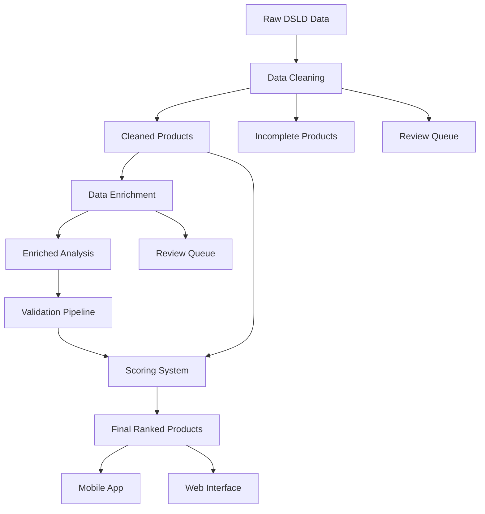

# DSLD Data Processing Pipeline Architecture

## Overview

The DSLD (Dietary Supplement Label Database) processing pipeline is a comprehensive system designed to clean, enrich, and score dietary supplement data for analysis and ranking. The pipeline follows a modular, stage-based architecture that ensures data quality and consistency throughout the process.

## Pipeline Stages

### 1. 🧹 **Data Cleaning Stage**

**Script:** `clean_dsld_data.py`
**Input:** Raw DSLD JSON files
**Output:** Cleaned, standardized supplement data

#### Purpose:

- Standardize ingredient names and categorizations
- Clean and normalize product information
- Map ingredients to reference databases
- Validate data completeness

#### Output Structure:

```
output_{ProductType}/
├── cleaned/
│   ├── cleaned_batch_1.json
│   └── cleaned_batch_2.json
├── incomplete/         # Products missing critical data
├── needs_review/       # Products with potential issues
├── unmapped/          # Products with unmapped ingredients
└── reports/
    └── processing_summary.txt
```

#### Key Features:

- **Ingredient Mapping**: Maps raw ingredient names to standardized forms
- **Data Validation**: Ensures all required fields are present
- **Batch Processing**: Handles large datasets efficiently
- **Quality Scoring**: Assigns completeness scores to products

---

### 2. 🔬 **Data Enrichment Stage**

**Script:** `enrich_supplements_v2.py`
**Input:** Cleaned supplement data
**Output:** Enrichment analysis data (scoring metadata)

#### Purpose:

- Analyze ingredients for quality, safety, and efficacy
- Generate scoring precalculations for rapid ranking
- Identify allergens, contaminants, and beneficial compounds
- Prepare data for the scoring system

#### Output Structure:

```
output_{ProductType}_enriched/
├── enriched/
│   ├── enriched_cleaned_batch_1.json
│   └── enriched_cleaned_batch_2.json
├── needs_review/       # Products requiring manual review
└── reports/
    ├── enrichment_final_summary_YYYYMMDD_HHMMSS.json
    ├── enrichment_summary_YYYYMMDD_HHMMSS.json
    ├── failure_analysis_report_YYYYMMDD_HHMMSS.md
    ├── detailed_failure_report_YYYYMMDD_HHMMSS.json
    └── unmapped_ingredients_report_YYYYMMDD_HHMMSS.md
```

#### Key Features:

- **Ingredient Quality Analysis**: Scores ingredients based on bioavailability and form quality
- **Contaminant Detection**: Identifies harmful additives, allergens, and banned substances
- **Synergy Analysis**: Detects beneficial ingredient combinations
- **Clinical Evidence Matching**: Links ingredients to clinical studies
- **Enhanced Reporting**: Generates detailed unmapped ingredients reports
- **Validation Pipeline**: Optional post-enrichment validation

#### ⚠️ **Important Architectural Note:**

The enriched files contain **only enrichment analysis data**, not the original product information. This separation is intentional:

- **Cleaned files**: Original product data (ingredients, claims, manufacturer info)
- **Enriched files**: Analysis metadata (scores, allergen flags, quality metrics)
- **Final scoring**: Merges both datasets for complete product profiles

---

### 3. 📊 **Scoring Stage** (Future)

**Status:** In Development
**Purpose:** Generate final supplement quality scores using enriched data

#### Planned Features:

- Merge cleaned and enriched data
- Apply scoring algorithms
- Generate ranked product lists
- Export for mobile app consumption

---

### 4. 🚀 **Deployment Stage** (Future)

**Status:** Planned
**Purpose:** Deploy scored data to production systems

---

## Data Flow Architecture



## Configuration System

### Cleaning Configuration

**File:** `config/cleaning_config.json`

- Input/output paths
- Processing settings
- Validation rules

### Enrichment Configuration

**File:** `config/enrichment_config.json`

- Reference database paths
- Scoring weights and thresholds
- Processing performance settings
- Enhanced reporting options

## Reference Databases

Located in `data/` directory:

### Core Databases:

- **`allergens.json`**: Known allergens and sensitizers
- **`harmful_additives.json`**: Additives with safety concerns
- **`banned_recalled_ingredients.json`**: Prohibited substances
- **`ingredient_quality_map.json`**: Ingredient forms and bioavailability
- **`rda_optimal_uls.json`**: Dosage recommendations and limits

### Analysis Databases:

- **`synergy_cluster.json`**: Beneficial ingredient combinations
- **`absorption_enhancers.json`**: Compounds that improve nutrient uptake
- **`clinical_evidence.json`**: Scientific backing for ingredients
- **`standardized_botanicals.json`**: Quality herbal extracts

## Quality Assurance

### Automated Validation

- **Data integrity checks**: Ensures no data loss between stages
- **Mapping validation**: Verifies ingredient mapping success rates
- **Score validation**: Validates scoring calculation accuracy

### Enhanced Reporting

- **Unmapped Ingredients Report**: Lists ingredients needing database additions
- **Processing Summary**: Overall pipeline performance metrics
- **Quality Flags**: Identifies products requiring manual review

### Success Metrics

- **Mapping Success Rate**: >95% target for ingredient mapping
- **Processing Success Rate**: >99% for data pipeline completion
- **Validation Success Rate**: >85% for enrichment validation

## Best Practices

### 1. **Data Integrity**

- Always run validation after each stage
- Monitor unmapped ingredients reports
- Review processing summaries for anomalies

### 2. **Performance Optimization**

- Adjust batch sizes based on system capacity
- Use parallel processing for large datasets
- Monitor memory usage during processing

### 3. **Quality Control**

- Regular review of unmapped ingredients
- Periodic database updates
- Validation of scoring algorithms

### 4. **Error Handling**

- Comprehensive logging at all stages
- Graceful degradation for partial failures
- Automatic retry mechanisms for transient errors

## Troubleshooting Guide

### Common Issues:

#### 1. **Unmapped Ingredients**

- **Cause**: Ingredient not in reference databases
- **Solution**: Review unmapped ingredients report, add to appropriate database
- **Prevention**: Regular database updates, fuzzy matching improvements

#### 2. **Processing Failures**

- **Cause**: Data format issues, missing files, configuration errors
- **Solution**: Check logs, validate input data, verify configuration
- **Prevention**: Pre-processing validation, comprehensive error handling

#### 3. **Low Mapping Success Rate**

- **Cause**: Poor ingredient standardization, outdated databases
- **Solution**: Update cleaning rules, expand reference databases
- **Prevention**: Regular database maintenance, community contributions

#### 4. **Configuration Mismatches**

- **Cause**: Incorrect paths in configuration files
- **Solution**: Verify all paths exist and point to correct directories
- **Prevention**: Path validation in configuration loading

## File Naming Conventions

### Input Files:

- Raw data: `{original_filename}.json`
- Cleaned data: `cleaned_batch_{n}.json`

### Output Files:

- Enriched data: `enriched_cleaned_batch_{n}.json`
- Reports: `{report_type}_{YYYYMMDD_HHMMSS}.{ext}`

### Directory Structure:

- Processing output: `output_{ProductType}/`
- Enrichment output: `output_{ProductType}_enriched/`
- Configuration: `config/`
- Reference data: `data/`

## Performance Metrics

### Target Performance:

- **Cleaning**: 1000+ products/minute
- **Enrichment**: 500+ products/minute
- **Memory Usage**: <8GB for full dataset
- **Success Rate**: >99% for standard processing

### Monitoring:

- Processing time per batch
- Memory consumption
- Success/failure rates
- Mapping statistics

## Future Enhancements

### Planned Improvements:

1. **Real-time Processing**: Streaming data pipeline
2. **Machine Learning**: Improved ingredient mapping with ML
3. **API Integration**: Direct database updates from regulatory sources
4. **Dashboard**: Real-time monitoring and analytics
5. **Cloud Deployment**: Scalable cloud-based processing

### Research Areas:

- Advanced ingredient interaction analysis
- Predictive quality scoring
- Personalized supplement recommendations
- Integration with health tracking systems

---

_For technical support or questions about the pipeline architecture, please refer to the individual script documentation or contact the development team._
